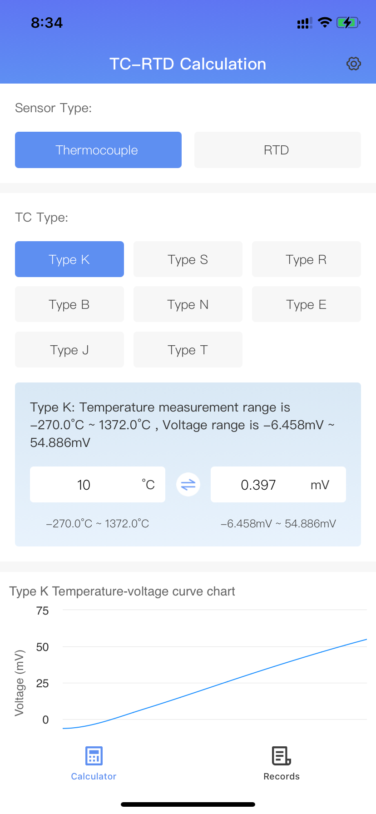

# TC-RTD

When purchasing a house, the lighting conditions are a crucial factor to consider. The "Daylight Calculator App" provides a convenient and accurate method for assessing the lighting situation on selected floors. It also includes a schedule of sunrise and sunset times, making it easy for you to plan activities such as watching the sunrise and sunset. From a 3D perspective, it presents the sunlight situation of the house comprehensively, helping you make wise choices.

Whether it's a house that doesn't get much sunlight or has a short sunlight duration, our app can alleviate your concerns. With simple one-click operation, you can obtain detailed information about the lighting conditions on the selected floors, including predictions of sunrise and sunset times. Our daylight calculator utilizes advanced algorithms and data models, considering factors such as the orientation of the house and the height of surrounding buildings, to provide you with accurate lighting analysis.

Moreover, our app offers practical advice and solutions to help you optimize the lighting environment of your house. No need for complicated settings or professional knowledge—simply input basic information about the house, such as the floor and orientation, to receive a detailed lighting report. Our recommendations are tailored to your specific situation, ensuring you get the best lighting experience.

Whether you need to assess lighting conditions during the house-buying process or want to improve your living environment in daily life, our app can meet your needs. We are committed to providing users with convenient, accurate, and practical lighting solutions, making your living experience more comfortable and enjoyable.

Download the "Daylight Calculator App" now and let us enhance your house selection and quality of life together!

Support or Contact

qqGroup: 820594265

Email: supportsw365@163.com

Beijing Kata Technology Co., Ltd.
